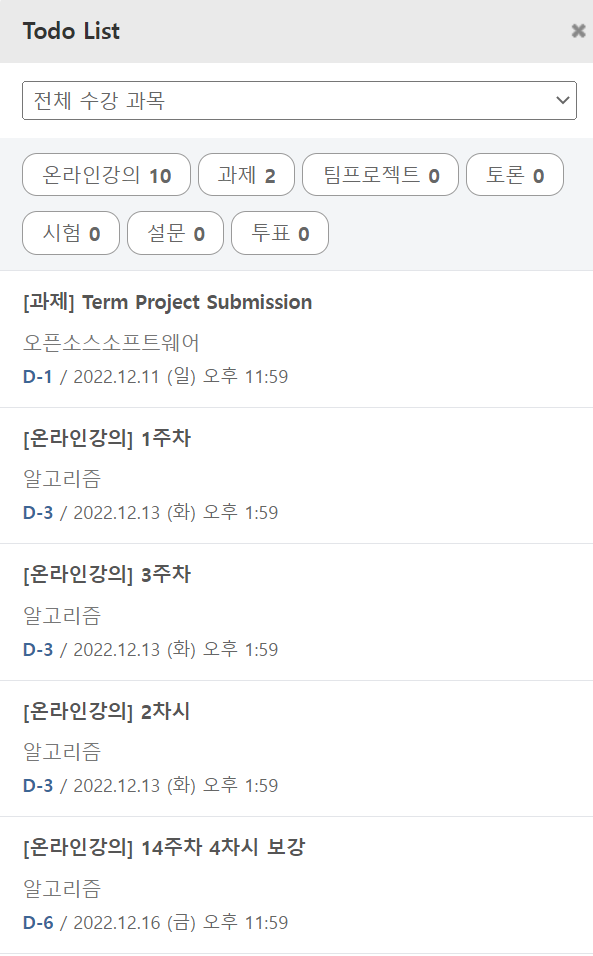

# TodoList-Reminder
Eclass **TodoList**를 discord로 **알림** 보내주기
## Contents
1. [Outline](#Outline)
2. [Description](#Description)
3. [Example](#Example)
4. [Conclusion](#Conclusion)
## Outline
코로나 펜더믹 이후로 대학생들은 온라인 수업을 받게 되고 eclass가 활성화 되었습니다. 대면 수업이 활성화된 지금도 공지사항을 확인하거나 과제를 제출할 때 eclass를 활용합니다. 제출하지 않은 과제에 대한 알림이 사용자가 설정한대로 오면 유익할 것 같습니다. 
## Description
eclass에 있는 TodoList을 crawling해서 원하는 항목을 설정한 시간마다 디스코드 채널에 채팅으로 기한이 얼마나 남았는지 알림을 보내줍니다.
### 사용법
1. crawling을 위해 chormedriver을 root directory에 설치해줍니다. Chrome 우상단에 ...을 클릭한 뒤 Chrome 정보에 들어가면 버전을 확인할 수 있습니다. 버전에 맞는 드라이버를 설치하시면 됩니다. [설치 링크](https://chromedriver.chromium.org/downloads)
1. discord 서버에 들어오셔서 reminder 채널에 접속해 주시면 됩니다.
[초대 링크](https://discord.gg/T6SjQjQV)
1. class todolist에서 SchoolID = os.environ.get('School_ID'), SchoolPW = os.environ.get('School_PW') 이 부분에 eclass id와 pw을 입력해줍니다.
```python
class TodoList:
  SchoolID = os.environ.get('School_ID')  # SchoolID = '' put your eclass id
  SchoolPW = os.environ.get('School_PW')  # SchoolPW = '' put your eclass pw
```
4. token = ''를 넣어줍니다.
```python
token = 'given token'
```
5. 파이썬 파일(reminder_bot.py)을 실행합니다.
6. discord 채널에 접속해 /활성화, /재설정 명령어를 채팅으로 입력해줍니다. 
### 프로그램 기능
1. /활성화<br/>
discord 채팅에 /활성화를 채팅으로 보내면 자동으로 eclass todolist를 crawling해 줍니다. crawling한 항목을 todolist class 객체에 저장합니다. 항목 번호, 몇 일 전부터 알림을 보내 줄 것인지, 몇 분마다 알림을 보내 줄 것인지 사용자에게 입력 받아 remindbot()을 실행합니다. remindbot()은 시간마다 알림을 보내줍니다.
```python
remindbot.start(TodoLists, nums, days, minutes)
```
2. /재설정<br/>
101은 추가 102는 삭제 103는 변경입니다. todolist class를 객체로 구성된 list를 기반으로 항목 번호(nums), 몇 일 전으로 설정할지(days), 몇 분마다 알림을 보내줄지(minutes)도 마찬가지로 list로 저장하여 추가, 삭제, 변경이 가능하도록 만들었습니다.
## Example
현재 저의 Eclass Todolist는 다음과 같습니다.<br/>
  
<p align="right"></p>
## Conclusion

### 결론 및 보완점
### 소감
